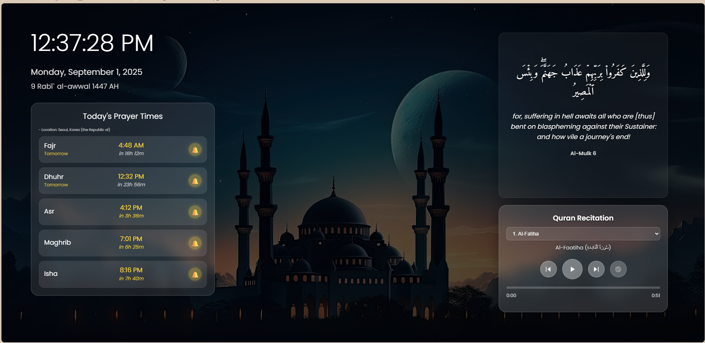
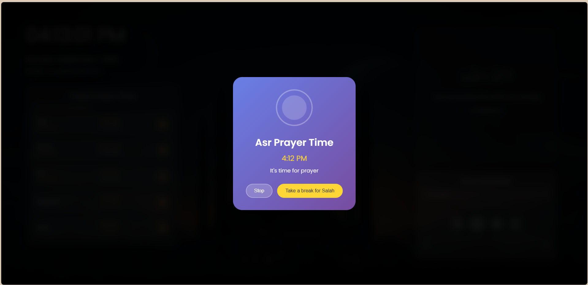
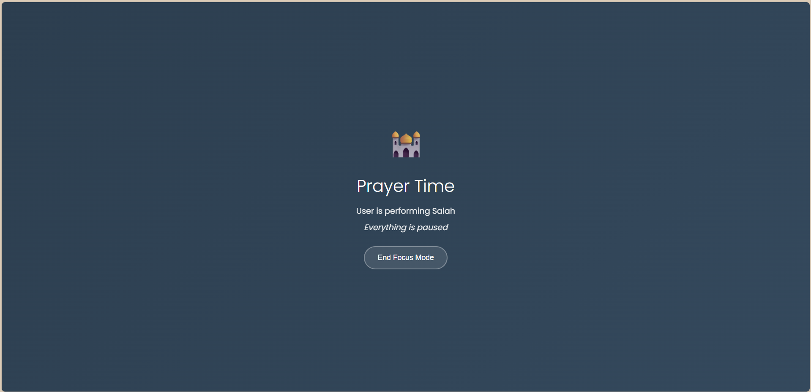

# Islamic Homepage

<div align="center">  <p><em>A serene Islamic-themed homepage — prayer times, Quran recitation, and adhan reminders, all in one place.</em></p> </div>

A beautiful application that provides an Islamic-themed homepage with essential features for Muslims.

## 🌙 About

Islamic Homepage is built to help Muslims stay connected with their faith throughout the day.
It brings together the essentials of worship in a peaceful digital space: prayer times, Quranic recitation, adhan reminders, and more.

Instead of a cluttered homepage, you'll be welcomed with the remembrance of Allah ﷻ and tools to help you stay mindful of salah and the Qur'an.

## 🕌 How It Helps You

✨ Never Miss Salah – Accurate prayer times, tailored to your location.

📖 Stay Close to Qur’an – Daily ayah with translation, plus a built-in recitation player.

🔔 Adhan Reminders – Gentle alerts with the sound of azan.

🌸 Serene Focus Mode – Step away from distractions when it’s time to salah.

🎨 Islamic Aesthetic – Minimal, calming design that nourishes reflection.

## ✨ Features

### 📅 Prayer Times

- Location-based calculations (via trusted Islamic APIs)
- Toggle notifications for each salah
- Countdown until the next prayer
- Authentic adhan audio for reminders

<div align="center">  <p><em>Adhan notification with options for focus</em></p> </div>

### 🕋 Focus Mode

- Dedicated "ibadah mode" during salah
- Suspends media & notifications
- Creates a digital environment of sakinah (peace)

<div align="center">  <p><em>Focus mode for distraction-free prayer</em></p> </div>

### 📖 Quran Features

- **Daily Verses**: Displays a beautiful Quranic verse with translation
- **Integrated Quran Player**: Listen to Quran recitations directly from the interface
- **Surah Selection**: Choose from all 114 surahs of the Quran
- **Playback Controls**: Play, pause, skip verses, and track progress
- **Auto-Play Toggle**: Option to automatically continue to the next verse

### ⏰ Time & Date

- **Digital Clock**: Displays current time in your preferred format
- **Dual Calendar**: Shows both Gregorian and Hijri dates
- **Location Display**: Shows your current location for prayer time calculations

### 🖼️ Additional Features

- **Islamic Aesthetic Wallpapers**: Automatically rotating beautiful Islamic wallpapers
- **Responsive Design**: Works perfectly on all screen sizes
- **Customizable Settings**: Full control over all features through a settings panel

## 🛠️ Technical Implementation

- **Responsive Design**: Works seamlessly on desktop and mobile devices
- **Location Services**: Uses geolocation to determine accurate prayer times
- **Audio Integration**: Smooth playback of Quran recitations and azan notifications
- **Local Storage**: Remembers your preferences between sessions
- **Cross-Tab Synchronization**: Maintains state across multiple browser tabs

## 🚀 Getting Started


1. Download the extension from Releases and extract it.
2. Open Chrome and go to `chrome://extensions/` (or ⋮ > More Tools > Extensions).
3. Enable Developer Mode.
4. Click Load unpacked and select the extracted folder.
5. The Islamic Homepage extension will be added.
6. If the Customize Chrome bar appears at the bottom, click it → Hide footer on New Tab page.
7. Allow Location Permission when prompted (needed for accurate prayer times).


## 🔄 APIs Used

- **Al-Quran Cloud API**: For fetching Quranic verses and translations
- **Aladhan API**: For Islamic calendar conversion and prayer times
- **Unsplash**: For high-quality Islamic wallpapers

## 🤝 Contributing

Contributions are welcome! If you'd like to improve the Islamic Homepage, please feel free to submit a pull request or open an issue.


## 📁 File Structure

```
Islamic-Homepage/
├── homepage.html          # Main homepage HTML
├── styles.css            # Homepage styling
├── script.js             # Homepage functionality
├── azan_all.mp3          # Azan audio file for regular prayers
├── azan_fajr.mp3         # Special Fajr azan audio
├── screenshots/          # Screenshots for documentation
│   ├── homepage.png
│   ├── azan_mode.png
│   └── Namaz_focus_mode.png
```


---

<div align="center"> <p><em>Made with ❤️ and du‘a, for the Muslim Ummah</em></p> <p><strong>May Allah ﷻ bless your time, guide your steps, and accept your salah 🤲</strong></p> </div>


## 📝 License

This project is open source and available under the MIT License.

## 🆘 Support

If you encounter any issues or have suggestions, please create an issue in the repository.

---

**May Allah bless your day with peace and guidance** 🤲

*Barakallahu feeki* - May Allah bless you